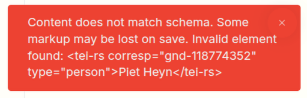
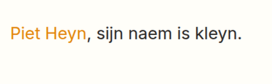
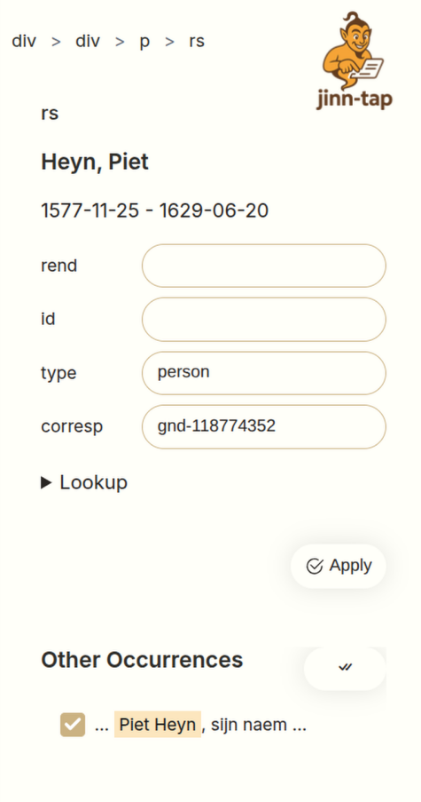

The **Jinntap** integration brings editing of your documents directly in your app. It enables
creating new TEI files and editing existing ones.

# How to customise this for your own situation

The TEI is a very flexible schema, with multiple ways to encode essentially the same concept. A list
may contain items that contain paragraphs themselves, or items with text directly. The format of
references, and where to retrieve them is not set in stone. Linking facsimiles for a manuscript done
 in different ways. Written manuscripts use different tags than Stone sutras or Mayan
inscriptions.

Jinntap does not intend to specify which tag set should be used in what way. Instead, if offers a
way to configure the schema (through a schema.json file) to specify the role of elements, what
attributes they have and how authors work with them.

#### Considerations

Only configure the elements you need and remove any built-in elements you are not going to
use. Whereever the TEI provides different encodings, stick with one and only configure one.

## Element Configuration

When you edit a document with JinnTap, you may see a warning: `Content does not match schema. Some
markup may be lost on save. Invalid element found:`. This indicates your document uses an element
that is not configured yet.



### Schema

We need to update the schema. The default is in `resources/schema/schema.json`. Add new elements by
appending into the `schema` object. Inline elements have a `type` set to `inline`, block elements
have a `type` set to `block`. Usually these new elements have some kind of attribute set. Add those
as well. The `type` property there provides schema validation.

#### Example

```jsonc
{
  // …
  "schema": {
    // …
    "rs": {
     "type": "inline",
     "attributes": {
       "type": {
         "type": "string",
         "enumeration": [
           "event",
           "person"
         ]
       }
     }
    }
  }
}
```

### Styling

This only makes JinnTap aware of the element. It will not remove it when saving the document. But it
does not make it visible. Without any styling authors will not have any use of it.

Style elements in the `resources/css/editor-styles.css` file. The HTML will have a similar
structure as the TEI XML, but element names are prefixed with `tei`. If you added an element called
`rs`, you can target the `tei-rs` HTML element. Any configured attributes are also copied to the
element.

#### Example

```css
tei-rs[type="person"] {
  color: #e48500;
}
```



#### Considerations

Take contrast into account, and try to use relevant iconography when possible.


### Toolbar

Now we made the editor aware of the element, and we show the new element to the author. Next step is
to insert them.

Elements can be on the toolbar in two ways. Directly on the toolbar, or in a drop-down select.

Directly on the toolbar makes the element very visible:

#### Example

```jsonc
{
  // …
  "schema": {
    // …
    "rs": {
     "type": "inline",
     "attributes": {
     // …
     },
     "toolbar": {
       // This determines the tooltip of the button
       "Person": {
         // If there are different appearances of a single element, define them here
         "attributes": { "type": "person" },
         // The label can usually just be an icon. Use the open source Bootstrap icon set
         "label": "<i class='bi bi-person-fill'></i>",
         // The order option defines where an option is placed, lower places it at the start
         "order": 2
        }
      }
    }
  }
}
```

They can also be inserted through selects:

#### Example

```jsonc
{
  // …
  "selects": {
    "Textcritical": {
      "label": "<i class='bi bi-highlighter'></i>"
      }
    }
  },
  "schema": {
    // …
    "rs": {
     "type": "inline",
     "attributes": {
     // …
     },
     "toolbar": {
       // This determines the tooltip of the button
       "Person": {
         // The select property moves this option to the dropdown select.
         "select": "Textcritical",
         // The order option defines where an option is placed, lower places it at the start
         "order": 2,

         // If there are different appearances of a single element, define them here
         "attributes": { "type": "person" },
         // The label can usually just be an icon. Use the open source Bootstrap icon set
         "label": "<i class='bi bi-person-fill'></i>"
        }
      }
    }
  }
}
```


#### Considerations

The toolbar is small, and space is at a premium. Try to put the most relevant elements directly on
the toolbar, and use selects for more exotic elements your authors use less often. Selects are less
discoverable, so put options your authors use a lot directly on the toolbar.

Authors scan a toolbar in reading order, place the most-used options on the far left side of the
toolbar. Use the "order" option to move them.

### Connectors

Some elements link to external systems, like GND, Airtable or Anton. Jinn-tap uses the
pb-authority-lookup element to link to these elements. Configure this in the schema.json.

#### Example

```jsonc
{
  // …
  "schema": {
    // …
    "rs": {
     "type": "inline",
     "attributes": {
       "corresp": {
         "type": "string",
		 "connector": {
		   "name": "GND",
		   "type": "person",
		   "prefix": "gnd"
		 }
       }
     }
    }
  }
}
```



## Configuration

The jinntap feature can be configured like this:

```jsonc
"features": {
 "jinntap": {
    "version": "<version>",
    "cdn": "https://cdn.jsdelivr.net/npm/@jinntec/jinntap",
    "schema": "resources/schema/schema.json"
  }
}
```

The schema defines the toolbar, which elements can be edited and more.

## Collaboration

Jinntap enables collaboration of multiple authors in the same document.

```jsonc
"features": {
  "collab": {
    "enable": true,
    "server": "wss://dev.tei-publisher.com/collab"
  }
}
```

